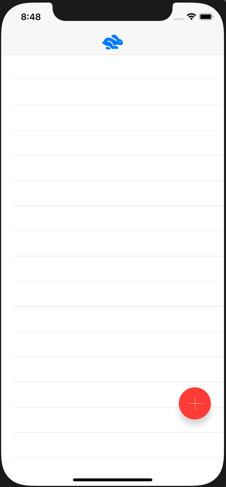

# Twitter like tableview App
This is a tableview thats like a twitter
- iOS 11
- Swift 5
- Xcode 12.4

## What's in this App?
- Reusing custom TableViewCell.xib file
- Floating Action Button
- Self-sizing tableview cell height depending on whether or not an image is selected
- Reload tableView after dismissing the ModalView
- Select photo
- Autolayout

